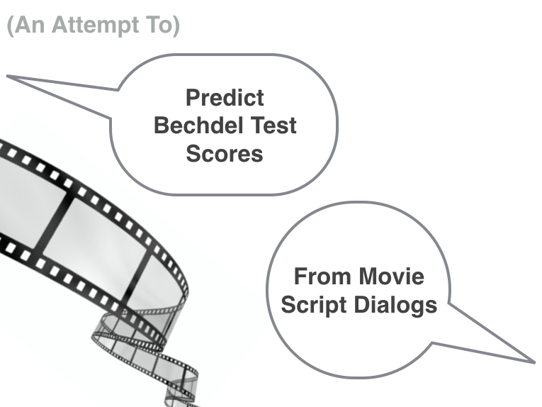
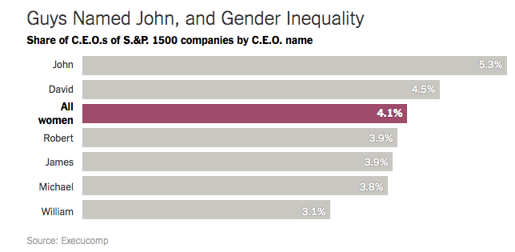

Predicting a Movie's Bechdel Test Score from its Script's Natural Language Features
=================================

An Exploratory Machine Learning Analysis by Lukmaan A. Bawazer

Overview
--------
**The Bechdel Test** is an informal rubric for assessing the extent to which a movie incorporates a female prespective in its narrative. The test was originally proposed in the 1980s by [Alison Bechdel and Liz Wallace](http://www.theatlantic.com/entertainment/archive/2015/08/call-it-the-bechdel-wallace-test/402259/), when the idea was publicly presented in a [comic piece crafted](https://en.wikipedia.org/wiki/Bechdel_test) by Bechdel. To receive a full passing mark, a movie must meet three conditions:

  
&nbsp; &nbsp; 1. The movie has at least two women in it...

  
&nbsp; &nbsp; 2. who talk to each other (at least once)...

  
&nbsp; &nbsp; 3. about something other than men.

Considering the relatively [low bar](http://www.slate.com/blogs/xx_factor/2014/01/07/the_bechdel_test_needs_an_update_we_ve_set_the_bar_for_female_representation.html) the test sets for female participation, it is **shocking how many movies fail**: **~42%** of movies fail in [a labeled dataset](http://bechdeltest.com/) that includes 6768 titles spanning more than a century of film; and about **1/3** of [blockbusters released in 2016](http://fusion.net/story/320598/2016-movies-bechdel-test/) fail.

**The machine learning perspective** explored here was inspired by a well-curated movie script dataset [created by a computer science research team at Cornell](http://www.cs.cornell.edu/~cristian/Chameleons_in_imagined_conversations.html), which includes character dialogs extracted from the scripts of 617 movies. The question motivating the analysis here is: **Can movie script dialog lanuage be used to predict whether or not a movie passes the Bechdel Test?** Second key dataset enabling the analysis comes from [bechdeltest.com](http://bechdeltest.com/), which provides human-assigned Bechdel Test labels for many movies. A previous effort has sought to [automate Bechdel Test scoring](https://github.com/JoeKarlsson/bechdel-test) based on gender tagging of charaters and named entity recognition to identify whether men are the focus of female-female dialogs. However, there are no previous efforts of which I'm aware that study whether Bechdel Test scores can be predicted from language usage throughout the script (e.g., including text from scenes with male-female and male-male dialogs).

Motivation
---------------
I find this question--can we predict the occurance of a fictionalized female-female interaction without looking for it directly?-- particularly interesting, because if such predictive power is indeed possible, it suggests that general dialog exchanges contain latent information about the gender inclusivity (or exclusivity) of an environment. While here these movie script environments are fictional, the work by the [Cornell team](http://www.cs.cornell.edu/~cristian/Chameleons_in_imagined_conversations.html) highlights that fictional dialogs can provide relevant insights into the real world. Further, gaining the ability to predict whether a movie marginalizes a disenfranchised group should be useful in working towards decreasing such marginalization, or at least in being better aware when such marginalization is occur--and understanding what language factors contribute to it.    

For a good reference that conveys the significance of character portrayals and stereotypes in media, I recommend the book [Influencer](https://www.amazon.com/Influencer-Science-Leading-Change-Second/dp/0071808868). That book describes examples where the fact that "TV and radio heroes become opinion leaders" can be harnessed for good, by creating programming that includes positive role models. *Influencer* describes instances where such an approach has been harnessed to increase access to education for women in India, and to reduce HIV transmission rates in East Africa. Unfortunately the ills stemming from negative stereotypes, even implicitly propogated stereotypes (for example: certain demographics should be seen and not heard) are pervasive, and well documented. For a conversation on the role of implicit stereotypes in race relations, I recommend [this article](https://www.theatlantic.com/politics/archive/2016/03/yale-silliman-race/475152/). There, Bria Godley writes:

"our environment contributes to the implicit biases that influence behavior. If we want to change our behavior, we have to address the injustices in our environment, regardless of how trivial they may seem relative to the big picture."

Ultimately, word selection for characters in movies matters, and plays a role in the unequal systems of our society. As one of many gut-wrenching pieces of evidence of such inequality, the [New York Times reported](https://www.nytimes.com/2015/03/03/upshot/fewer-women-run-big-companies-than-men-named-john.html?_r=0) that in 2015 there were more CEOs named John and David than the number of all female CEOs combined.

Outline of Analysis
---------------
**For step 1 see [this notebook](https://github.com/lab3000/machine-learning-bechdel-test/blob/master/obtaining_labels.ipynb)**

&nbsp; &nbsp; 1. Web scrape movie labels from [bechdeltest.com](http://bechdeltest.com/)

**For steps 2 through 9 see [this notebook](https://github.com/lab3000/machine-learning-bechdel-test/machine-learning-bechdel-test.ipynb)**

&nbsp; &nbsp; 2. Collate dialog lines for each movie [from Cornell study](http://www.cs.cornell.edu/~cristian/papers/chameleons.pdf) and merge with labeled data (407 total movies)

&nbsp; &nbsp; 3. EDA: score histograms (null model = 59% pass), Heaps Law

&nbsp; &nbsp; 4. Tokenization->Doc-Term Matrix (a) Count Vectorize, (b)TFIDF)

&nbsp; &nbsp; 5. Model Assessments, across 5 models and 12 term-doc matrices

&nbsp; &nbsp; 6. Create new corpus based on badwords, EDA of badword_corpus

&nbsp; &nbsp; 7. Repeat 4 and 5, but with the badword corpus

&nbsp; &nbsp; 8. Aggregate Models with GradientBoosting

&nbsp; &nbsp; 9. Conclusions/future work: >6300 more scripts that can be accessed, topic modeling, word2vec, devise and utilize a [new](http://www.slate.com/blogs/xx_factor/2014/01/07/the_bechdel_test_needs_an_update_we_ve_set_the_bar_for_female_representation.html) and more rigorous metric for assessing female impact in film

Summary of Results
---------------
**I found some evidence from this analysis supporting the hypothesis that movie script dialog language can be used to predict a movie's Bechdel Test score.** Initially, among five machine learning binary classification models I implemented, including multinomial naive bayes, random forest, logistic regression, AdaBoost, and a linear support vector classifier, none of them performed better than the null model, where the null model would be guessing universally that all movies pass--which gives 59% accuracy. However, by extracting from each movie's dialog the [offensive words](https://www.cs.cmu.edu/~biglou/resources/) in the script and using those sets of offensive words as a new corpus, I was able to see predictive lift, obtaining an accuracy of 66% with an AdaBoost classifier. This suggests that predictive power for this problem can be further imporved with more script data. Indeed, a significant bottleneck in the exploratory work here is that only 407 movie scripts were obtained from the intersection of my two sources of data (movie script data and Bechdel Test labels). This leaves an additional corpus >6300 scripts from Bechdel-labeled movie titles that could potentially be harnessed to generate additional dialog data in the future.

A large body of data is likely required to attain a significant boost in predictive power considering the minimalistic test criteria of the Bechdel Test. If a single exchange between two women about something other than men occurs just once, across a mere two or three lines in a movie: that brief scene is sufficient to change the test label. Given that low bar, it is interesting that I could obtain any predictive power from only 407 scripts. The feature engineering that enabled that predictivity involved filtering scripts for only profanity and offensive words, and using those offensive words as language features. That result implies a correlation between profanity and exclusion of a female perspectives.
